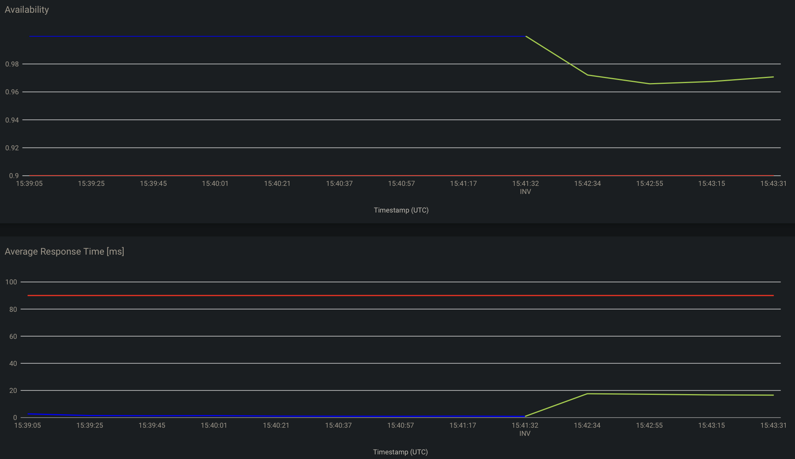
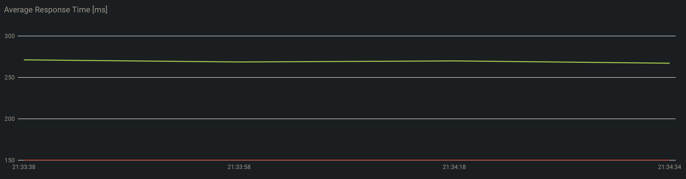
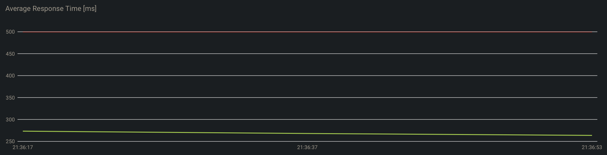
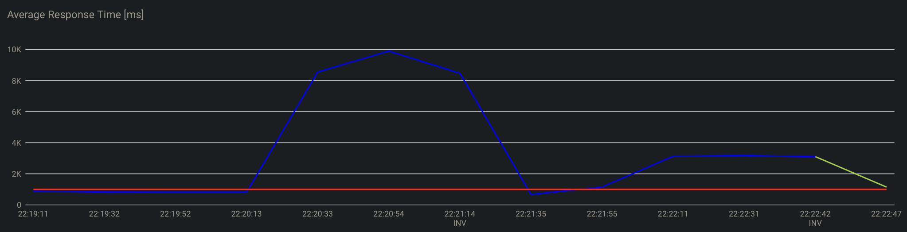
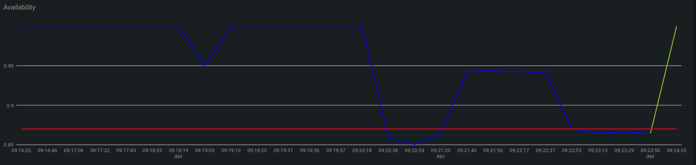

# RAMSES - ICSE2024 presentation
MSc final thesis project by Ettore Zamponi.

We present four scenarios that the actuator is able to recognise and apply to SEFA (application composed of microservices built ad-hoc).

In these scenarios, before each experiment is executed, the Managed System is freshly de-ployed with one nominal instance per service (i.e., without any manipulation).

Remember to clean the config-server on GitHub, after each adaptation, new weighted values for the adapted services are pushed into the application.properties file. Otherwise, when a new deployment of RAMSES is attempted, knowledge will find configuration incompatibilities and will not be able to be executed.

N.B. Pay attention to the github env var to be able to push on the correct config server!

## Development Ambient
Together with the actual code of both RAMSES and SEFA, we also provide a set of ready-to-use docker scenarios. By following the next steps, you can set up and run both systems on the same machine. 

To begin with, install [Docker](https://www.docker.com/) on your machine and run it. After the installation, we suggest to configure it with the following minimum requirements:
- **CPU**: 8
- **Memory**: 10GB
- **Swap**: 1GB

The whole Self-Adaptive System was developed, run and tested on a 2023 Apple MacBook Pro with the following specifications:
- **SoC**: Apple M2 Pro (10-core CPU, 16-core GPU)
- **RAM**: 16GB LPDDR4
- **Storage**: 512GB on NVMe SSD
- **OS**: macOS Sonoma 14.1.1
- **IDE**: Intellij IDEA
- **Docker** v24.0.6 (allocating 9 CPUs, 10GB Memory, 2GB Swap)

The **Java** version used by the project is version `16.0.2`.

Currently, docker images are available for `arm64` and `amd64` architectures, but due to port forwarding limitations and the use of socat software (or similar), it has not been possible to run the entire project on linux or windows machines.

## Installation guide

1. ### Install Docker

	Docker Engine is required to launch all the microservices, follow this [link](https://www.docker.com/get-started/) to download and install it if you do not have 	it yet.

2. ### Launch the socat command

	Launch the port forwarding command through Socat (or similar) as explained [here](#Troubleshooting-and-Known-Issues).
    
    To be able to launch this command.
    ```
   $ socat -d TCP-LISTEN:2375,reuseaddr,fork UNIX:/var/run/docker.sock
   ``` 

3. ### Create the configuration repo
	The next step involves the creation of a GitHub repository (if you don’t have one yet) to be used by the _Managed System Config Server_ as the configuration 	repository. You 	can do so by forking [our repository](https://github.com/ettorezamponi/config-server). Check that the `application.properties` file does not 	include any load balancer 		weight. If so, simply delete those lines and push on your repository.

	Once you have created your configuration repository, generate a GitHub personal access token to grant the _Managed System_ the permission to push data on your repository. You 		can do so by following [this 	guide](https://docs.github.com/en/authentication/keeping-your-account-and-data-secure/creating-a-personal-access-token).

   	At this point, enter your configuration repo and access token into the [bash script](/bash_scripts/execute/SETUP_ICSE.sh) initial variables.
   	
   ```
   export GITHUB_REPOSITORY_URL = ...
   export GITHUB_OAUTH = ...
   ```

4. ### Execute the script
   
   	Finally run the ready-to-use script, [SETUP_ICSE.sh](/bash_scripts/execute/SETUP_ICSE.sh).
   ```
   sh SETUP_ICSE.sh
   ```

## Scenarios

In this chapter, four distinct test and development scenarios are outlined. Each scenario provides a unique context for evaluating and advancing the subject matter. 

The goal is to demonstrate and show all the adaptations that managing is capable of, allowing for comprehensive testing and development considerations. The chapter delves into these scenarios to offer a nuanced understanding of the subject matter in various practical contexts, fostering a more robust approach to testing and development processes.

For simulation it's intended a script that automatically executes several interactions on the managed system, i.e., places an order, completes it with data, proceeds with payment for the food delivery. The simultion executes an order every 500 milliseconds, the total duration and other special configurations are explained in each of the following scenarios.

In order to understand how a simulation is carried out or to be able to create an ad hoc test scenario, a [furthered guide](#scenario-creation) is proposed.

* ### Scenario 1 - *UNREACHABLE SERVICE*

  This represents the real case in which one of the services crashes suddenly, or perhaps due to a momentary disconnection, and thus becomes unreachable. 
  To simulate this scenario it makes one of the microservices unreachable by forcing its shutdown.
  
  The managing will realise this situation, and will start (forced option) a new instance of the same service in order to resume the correct execution of the entire system as soon as possible.

  To do this, a *failure injection* implemented in the simulation (lasting 5 minutes) [rest-client](./managed-system/rest-client/src/main/java/sefa/restclient/domain/FailureInjectionService.java) code is used.
  In this case, it was decided to crash the 'sefa-restaurant-service' 180 seconds after the start modifying the following variables inside the [application.properties](./managed-system/rest-client/src/main/resources/application.properties).
  ```
  FAILURE_INJECTION = Y
  FAILURE_INJECTION_1_START = 180
  ID_OF_INSTANCE_TO_FAIL = restaurant-service@sefa-restaurant-service:58085
  ```

  After the crash, through the *plan*'s logs, it is seen that the service is unreachable, and a new one is forced to be added.
  ```
  Instances: restaurant-service@sefa-restaurant-service:58085
  Instance failed or unreachable
  
  FORCED - Add a new instance. Service: RESTAURANT-SERVICE No instances available
  ```
  The following graphs represent the trend of availability and average response time for the service under analysis.
  The red line reflects the limit to be maintained for availability, and the limit not to be exceeded for average response time.

  The blue line represents the performance of the service before adaptation, i.e. at the beginning of the simulation when no changes were made to our managed.
  The green one, instead, represent the performance after the adaptation, in this particular case, after that the managing added the new instance of *restaurant service*.

  In the graph we do not see a drop below the limit despite the forced shutdown of the service, this happens because each point that makes up the graph is an average of several orders executed by the simulation script.
  Thus the moment when the instance is unavailable is balanced and reestablished by subsequent orders. 
  For the availability, it creates a plot lower the precedent trend but still satisfactory. In fact, after the adjustment, the plot trend will tend to improve and re-establish on the initial values.

  

  Let it be clear that this situation can be replicated making unreachable all instances of SEFA and after any time.

  In addition, depending on the randomness of the simulation, sometimes the *ordering service* tends to have a response time of approximately 1000-1200 ms, so during the simulation we can also see the addition (non-forced option) of an instance of the *ordering service* in order to observe the threshold.
  ```
  ORDERING-SERVICE: Selected option AddInstanceOption for AverageResponseTime with benefit 1.507561964285497.
  Details: Goal: AverageResponseTime - Add a new instance. Service: ORDERING-SERVICE The service avg response time specification is not satisfied
  ```

* ### Scenario 2 - *CHANGING IMPLEMENTATION*

  This represents the most complete scenario in which the managing recognises a better implementation, stops the old container and starts the new one with higher benefits.

  To simulate the real case where a service is unable to meet certain specifications or begins to perform unsatisfactorily, at the beginning of the simulation, a very low Average Response Time threshold (150) is set such that it cannot be met by the *delivery service* instance, through the [application.properties](./managed-system/rest-client/src/main/resources/application.properties) of the simulation.
  After 120 seconds the threshold will be reset to a normal value, so that the newly instantiated service will be able to meet it. 
  ```
  CHANGE_THRESHOLD=Y
  MAX_ART_THRESHOLD=150
  CHANGE_THRESHOLD_START=10
  CHANGE_THRESHOLD_DURATION=120
  DEFAULT_THRESHOLD=500
  ```

  In fact, the trend of the average response time does not meet the set limit by being above the threshold represented by the red line.
  
  

  The managing notices the problem, and changes the implementation seeing that *delivery-proxy-2-service* has much better values than the first one, which is not working well.
  
  These are the configuration of the three different potential instances of the *delivery-proxy-service* settled in the configuration file [system_architecture.json](./managing-system/knowledge/architecture_sla/sefa/system_architecture.json):
  ```
  "service_id":"DELIVERY-PROXY-SERVICE",
    "implementations" : [
        {
            "implementation_id" : "delivery-proxy-1-service",
            "implementation_trust" : 1,
            "preference" : 0.2,
            "instance_load_shutdown_threshold" : 0.4
        },
        {
            "implementation_id" : "delivery-proxy-2-service",
            "implementation_trust" : 9,
            "preference" : 0.6,
            "instance_load_shutdown_threshold" : 0.4
        },
        {
            "implementation_id" : "delivery-proxy-3-service",
            "implementation_trust" : 7,
            "preference" : 0.2,
            "instance_load_shutdown_threshold" : 0.4
        }
    ]
  ```
  The simulation lasts 5 minutes and the plan's logs will show the correct change implementation adaptation executed.
  ```
  DELIVERY-PROXY-SERVICE: Selected option ChangeImplementationOption for AverageResponseTime with benefit 1.0760645103065511. 
  Details: Goal: AverageResponseTime - Change DELIVERY-PROXY-SERVICE implementation from delivery-proxy-1-service to delivery-proxy-2-service. Changing implementation
  ```
  At this point the correct Average Response Time threshold will be restored to a normal value (in other cases, RAMSES will continue to allocate container to respect the unfeasible threshold) and the new implementation could satisfy it.
  
  

  In the proposed graphs we do not see differences in trends before and after adjustment (as in the previous scenario changing colors) because when a new threshold is set, the graph is recalculated from scratch with the new data available. In other words, you get two graphs each with its threshold, and you only notice the trend of the service under examination and the threshold set during that time period.

* ### Scenario 3 - *LOAD BALANCING CONFIGURATION*

  This particular action is performed whenever there is an adaptation, in particular whenever a new service is allocated in aid of the previous ones already in place.
  In particular, the *change load balancer weight* takes care of distributing the workload between different instances of the same service.

  In this scenario, managing and managed were deployed normally. During the simulation (10 minutes) the Average Response Time of the ordering-service is raised twice, after 90 seconds and after 180 seconds from the start of the simulation, settings its value in the [application.properties](./managed-system/rest-client/src/main/resources/application.properties) file.
  
  ```
  FAKE_SLOW_ORDERING=Y
  
  FAKE_SLOW_ORDERING_1_SLEEP=1000
  FAKE_SLOW_ORDERING_2_SLEEP=600
  
  FAKE_SLOW_ORDERING_1_START=90
  FAKE_SLOW_ORDERING_1_DURATION=60
  FAKE_SLOW_ORDERING_2_START=180
  FAKE_SLOW_ORDERING_2_DURATION=60
  ```

  By doing so, only one instance will not be able to maintain the average response time within the threshold, consequentially the managing will start another *ordering service* in addition to the existing ones. The *load weight balancing* function will take care of splitting the work and, very importantly, save any new weight changes in the GitHub repository used by the configuration server.

  The plot of the *ordering service* show the benefits of this adaptation: initially instantiating a new service when the first one is slowed and splitting the workload between the old and the new instance, indeed the blue peak represents the first slowdown in the average response time;
  and then, changing the load balancing weights when only the first instance is slowed again entrusting more work to the instance that performs better, in fact the second one is not slowed down. 

  This graph represents the entire progress of the simulation, changing color to green after the second adaptation has been carried out.

  

  As seen below, the result of the second adaptation could be seen in the configuration repo and in the *plan* service logs.

  ```
  loadbalancing.ordering-service.sefa-ordering-service-35359_35359.weight=0.8
  loadbalancing.ordering-service.sefa-ordering-service_58086.weight=0.2
  ```
  ```
  Details: Goal: AverageResponseTime - Change LBW. Service: ORDERING-SERVICE
  New weights are: {ordering-service@sefa-ordering-service:58086=0.2, ordering-service@sefa-ordering-service-35359:35359=0.8}.
  At least one instance satisfies the avg Response time specifications
  ```

  Configurations are saved every time they are changed, so that each time the managing is restarted, the changes are retrieved during the knowledge start-up. It is therefore important to clean up the configuration repo each time you want to re-deploy a clean managing system.

* ### Scenario 4 - *HANDLE SLOW SERVICE*

  In this last scenario we see the last of the adaptation options that RAMSES is able to implement, namely *handleShutdownInstanceOption*.

  We create a simulation (lasting 10 minutes) where after 90 seconds from the start we deliberately slow down the *ordering service* for one minute (after which it will be reset to normal values). 
  This will cause the managing to start a new instance to help our slowed down service. 
  
  As the previous scenarios, through the [application.properties](./managed-system/rest-client/src/main/resources/application.properties).

  ```
  FAKE_SLOW_ORDERING=Y
  FAKE_SLOW_ORDERING_1_SLEEP=1000
  FAKE_SLOW_ORDERING_1_START=90
  FAKE_SLOW_ORDERING_1_DURATION=60
  ```

  After this, the workload will be handled by two instances that will divide the workload in half by setting weights (as seen in the previous scenario) resulting in the configuration repo as follows.
  
  ```
  loadbalancing.ordering-service.sefa-ordering-service-42315_42315.weight=0.5
  loadbalancing.ordering-service.sefa-ordering-service_58086.weight=0.5
  ```

  At this point, after 260 seconds from the beginning, we lower the availability of one of the two instances of the 28%, so that the average availability of the entire ordering-service straddles the threshold.
  In this way, the managing will have to take note of the unfollowed threshold and act accordingly, in other words add another instances or change the load balancing weights again.
  
  The managing, probably would change the load balancing weights assigning more work to the instance that performs better and has not been slowed down.

  After 400 seconds we will perform the same slowdown again to the same instance as before (the one with a lower workload).
  
  Through the same properties file.

  ```
  FAKE_EXCEPTION_ORDERING=Y
  FAKE_EXCEPTION_VALUE_1=0.28
  FAKE_EXCEPTION_VALUE_2=0.7
  FAKE_EXCEPTION_START_1=260
  FAKE_EXCEPTION_START_2=400
  ```

  Finally, the managing will realise that the threshold has not been met and will change the weights of the two instances (*plan*'s logs), reducing the workload of the least available instance to zero and thus shutting it down definitively.

  ```
  Executing adaptation option: Goal: Availability - Change LBW. Service: ORDERING-SERVICE
  New weights are: {ordering-service@sefa-ordering-service-42315:42315=1.0}.
  SHUTDOWN INSTANCE REQUEST: serviceId= ORDERING-SERVICE, instanceToShutdownId=ordering-service@sefa-ordering-service:58086
  ```
  And consequently updating the configuration repo in this way:

   ```
   loadbalancing.ordering-service.sefa-ordering-service-42315_42315.weight=1.0
   ```
  
  The availability plot of the *ordering service* clearly shows the benefits of weight changes occurring twice, when the availability goes under the threshold.
  
  The first drop after 60 seconds is when a new instance of the *ordering service* is added. 
  The first major drop below the threshold is the first time the service is slowed down in order to change the workload weights.
  And finally, when the process changes color to green, it happens following the last adaptation in which the managing proceeded to turn off the repeatedly slowed down instance. Consequently the performance of the service will tend to recover and have an upward curve.
  

  If the availability is very close or straddles the threshold, it is more likely that the weights will be changed, otherwise, if there is a large gap between the actual availability and the threshold, a new instance will be added to help the two already present.

  In this same simulation, it happened to see both a change of weights as desired and the addition of a new instance. This is due to the random part of the simulation, fake purchases and various mathematical calculations which even in a real scenario cannot be controlled.

## Scenario creation

It is provided together with the managed system, a [REST client](./managed-system/rest-client) which simulates a large number of orders on the test food delivery service, used as a managed.

This service initially activates the monitor and adaptations, both of which are deactivated by default as soon as managing is started.
Then the actual interactions with the managed will begin, every approximately 0.5 seconds, the REST client proceeds to complete an entire order on the managed on which it is acting.

In addition to the simple simulation, a number of [methods](./managed-system/rest-client/src/main/java/sefa/restclient/domain) are also offered that can modify and alter the behaviour of individual services in order to cause failures or slowdowns, in order to see how the managed is able to react.
Possibilities include making a service fail and shut down, simply slowing it down for a certain amount of time, or changing the thresholds to be met for an individual service.
All of these settings are to be managed via the [application.properties](./managed-system/rest-client/src/main/resources/application.properties) file of the REST client.
Within these configurations, each method can be activated via a boolean, as well as set which service to fail or after how many seconds to slow down a given instance.
See how they were modified within the scenarios to create customised test solutions.

Once we have our rest client set up properly, clean the GitHub configuration repo and run the new REST client in this way.

1) Build the client with the command `gradle build` inside the REST client folder.
2) Create de Docker image with the command `docker build -t restclient .` inside always the same root folder.
3) Launch the setup [script](./bash_scripts/execute/SETUP_ICSE.sh) following the initial installation [guide](#installation-guide) without any scenarios.
4) After all launch your new REST client through the command `docker run -P -d --network ramses-sas-net restclient`.


## Troubleshooting and Known Issues

1) A known issue on macOS involves the Actuator component, that sometimes cannot directly contact the Docker interface to run or stop containers. This results in the Instances Manager container to fail its booting process.
	
 	To solve this issue, install [Homebrew](https://brew.sh) if you do not have it yet, update its packages with the following command.

	```
	$ brew upgrade
	```
	
	Install the latest versione of [Socat](http://www.dest-unreach.org/socat/) (1.8.0.0) with this command.
	
	```
	$ brew install socat
	```
	
	Run this command so that socat is used to expose the Docker daemon on a specific TCP port (in this 	case, port 2375) so that requests can be handled via Docker's local UNIX socket.

	   
	   $ socat -d TCP-LISTEN:2375,reuseaddr,fork UNIX:/var/run/docker.sock

	
	If the path is not correct for the Docker configuration, follow this [forum question](https://forums.docker.com/t/is-a-missing-docker-sock-file-a-bug/134351) about.
   
3) Clean the *application.properties* file in the configuration server repo on GitHub after each adaptation.
4) Sometimes the Knowledge container is not able to find correctly all the service. Just try to restart the knowledge container, and only after its start-up, relaunch all remaining managing containers.
   This is a problem of the Discovery Client not fast enough to register or unregister services. [SOLVED]
